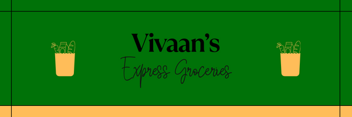

#

___
## A Revolutionary Online Grocery Delivery Service
___
Vivaan's Express Groceries is an **online grocery delivery service** that allows users to order top-quality, 
fresh groceries, without having to leave the comfort of their own homes. This application will
serve as a convenient and effortless solution to a long and tiring visit to the grocery store. 
We offer **competitive prices** for all our products, as well as **discounts for bulk orders**.

Vivaan's Express Groceries will offer:
- Fruits
- Vegetables
- Red meat
- Frozen foods
- Dairy
- Gluten-free and vegan options.

Users can select from a wide range of produce within these categories and have them delivered straight to their doorstep.

Vivaan's Express Groceries is based out of Vancouver, but we offer low-cost delivery to every major Canadian city including Vancouver,
Victoria, Calgary, Edmonton, Ottawa, and Toronto.

As a student, I have firsthand experience with the troubles of grocery shopping namely the long lines, inflated prices, low quality, 
confusing aisles, and most importantly, the physical struggle of carrying multiple bags of groceries home. This led me to think that I can find
it inconvenient to have to go grocery shopping every two weeks, what about older people like our parents and grandparents, or people with disabilities? That is why I created Vivaan's Express 
Groceries, a *user-friendly and accessible alternative* to the time-consuming, tiring, expensive, and inconvenient ordeal of everyday grocery shopping.

---
## User Stories
- As a user, I want to be able to browse groceries by the categories listed above.
- As a user, I want to be able to see a picture of the groceries while browsing.
- As a user, I want to see any available discounts or offers.
- As a user, I want to be able to add and remove groceries from my cart with ease.
- As a user, I want to be able to add multiple quantities of the same item to my cart.
- As a user, I want to be able to view my current bill at any time.
- As a user, I want to be able to save my address(es). 
- As a user, I want to be able to pay my bill online (by a credit card transaction).
- As a user, I want to be able to exit the application at any time.
- As a user, I want to be able to save my cart by saving it to file.
- As a user, I want to be able to return to my cart by loading it from file.